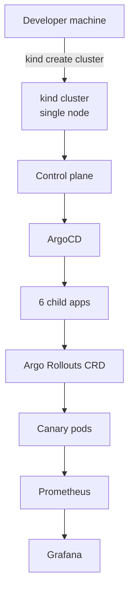

# Stackup

**Kubernetes on your laptop. ArgoCD + Argo Rollouts + Prometheus + Grafana. `make up` in ~12–15 minutes. Free.**

[](https://github.com/ykstorm/stackup/actions/workflows/ci.yml)
[](LICENSE)

---

## Why Stackup

Managed Kubernetes costs $200+/month minimum on cloud providers. Stackup runs the full production stack on kind, on your laptop, for free.

What "full production stack" means: a real ArgoCD app-of-apps with 6 child applications, Argo Rollouts canary progressive delivery, Prometheus + Grafana observability, cert-manager TLS, Sealed Secrets encrypted in git, Calico NetworkPolicy enforcement, and Pod Security Standards `restricted` on every workload namespace.

The bootstrapped canary subject is a small `demo` service (Express + prom-client). The cluster is the point — not the app.

---

## What's in the box

| Layer | Component | What it does |
|---|---|---|
| **Cluster** | kind on Docker | single-node K8s in containers |
| **CNI** | Calico | NetworkPolicy enforcement |
| **GitOps** | ArgoCD (app-of-apps) | One root app manages 6 children; automated sync + prune + self-heal |
| **Progressive delivery** | Argo Rollouts | Canary 25→50→75→100%, success-rate analysis gate at 25% with auto-rollback |
| **Ingress** | ingress-nginx | TLS termination, hostPort 80/443 |
| **TLS** | cert-manager | Self-signed ClusterIssuer (swap to ACME in one line for prod) |
| **Secrets** | Sealed Secrets | Encrypted secrets in git, decrypted in-cluster |
| **Metrics** | kube-prometheus-stack | Prometheus + Alertmanager + Grafana |
| **Workload demo** | demo Helm chart (helm/demo) | Express service that exports `http_requests_total` — the canary subject |
| **Hardening** | PSS `restricted` + NetworkPolicy `default-deny` | Zero-trust on workload namespaces |

### Roadmap (not installed yet)

| Layer | Component | What it would do |
|---|---|---|
| **Logs** | Loki + Promtail | Pod stdout → Loki → Grafana Explore |
| **Traces** | Tempo | OTLP traces from workloads |

---

## Quickstart

**Prerequisites:** Docker, `kind`, `kubectl`, `helm`. Give Docker **at least 6 GB of memory** (Docker Desktop → Settings → Resources). The full stack — Calico, kube-prometheus-stack, ArgoCD, and Argo Rollouts on one node — will start to crash-loop its controllers below ~4 GB.

```bash
git clone https://github.com/ykstorm/stackup && cd stackup
make up
```

The ingress hosts use `localtest.me`, which resolves to `127.0.0.1` — no `/etc/hosts` editing. Open:

- **[https://grafana.localtest.me](https://grafana.localtest.me)** — RED metrics from Prometheus (logs/traces are roadmap)
- **[https://argocd.localtest.me](https://argocd.localtest.me)** — GitOps tree of 6 child apps

The `demo` workload has no ingress. Reach it by port-forward:

```bash
kubectl -n app port-forward svc/demo 3000:3000
curl localhost:3000/metrics   # shows http_requests_total
```

---

## What it actually shows you

Push a commit that bumps `helm/demo/values.yaml` image.tag. ArgoCD notices and syncs. Argo Rollouts applies the new Rollout revision. Watch it advance:

```bash
make rollout-status
# same as: kubectl argo rollouts get rollout demo -n app --watch
```

The canary shifts 25% of traffic to the new version, pauses, then runs an analysis step. The `AnalysisTemplate` queries Prometheus for the 2xx HTTP success-rate ratio over a 2-minute window — `sum(rate(http_requests_total{code=~"2.."}[2m])) / sum(rate(http_requests_total[2m]))`. If the result holds at or above 0.95, the rollout advances to 50%, then 75%, then 100%. If it drops below, Argo Rollouts aborts and rolls back to the previous revision. This is the canary pattern teams run in production, on your laptop, for free.

The `demo` image exports `http_requests_total` directly (Express + prom-client), so the gate runs against real request data. Set `failureRate` on the chart to push a deliberately bad canary and watch the rollback fire.

### Verified in CI

This isn't a diagram-only claim. [`.github/workflows/canary-e2e.yml`](.github/workflows/canary-e2e.yml) stands up a real kind cluster, installs Argo Rollouts and a live Prometheus, drives steady 2xx traffic through the demo workload, then ships a new image and lets the canary run. The rollout advances **only** because the real `AnalysisTemplate` success-rate query clears the ≥0.95 gate — the same PromQL shown above, on real scraped data. Last run:

```
Status:   ✔ Healthy       Step: 8/8   SetWeight: 100
demo   Rollout   ✔ Healthy
└─ AnalysisRun demo-…-2-2   ✔ Successful
```

The `rate()` window (2m) and step pauses (30s) are the production values; the CI overlay ([`helm/demo/values.ci.yaml`](helm/demo/values.ci.yaml)) compresses only the *timing* so the genuine gate fits a runner — nothing about the analysis is mocked. Reproduce locally with `make up` and a `helm/demo/values.yaml` image bump.

---

## Architecture



For full topology + sequence diagrams, see [docs/architecture.md](docs/architecture.md).

A static documentation site (overview, getting started, architecture, GitOps + canary) is built from `docs-site/` and published to GitHub Pages on merge to `main`.

---

## Makefile targets

```bash
make help     # Show all targets
make up             # Full bring-up: create cluster + install platform + demo
make down           # Tear down kind cluster (clean)
make smoke          # Run smoke tests (requires cluster up)
make lint           # Lint all YAML + Helm charts
make rollout-status # Watch the demo Argo Rollout canary progress
```

---

## Limits

- No real LoadBalancer service type (kind doesn't ship one). We use hostPort. For real LB, deploy to a cloud cluster.
- Storage is local-path PVs by default. Re-creating the cluster wipes them. Add Longhorn or OpenEBS if you need persistence across teardowns.
- Single-tenant workload namespace. Multi-tenant needs additional NetworkPolicy and RBAC work (PRs welcome).
- The `demo` workload is a stand-in for your real service — it exists to drive the canary, not to be a product. (A legacy `buyerchat` chart still lives in `helm/buyerchat` as an example; it is not what `make up` deploys.)

## License

Apache License 2.0 — see [LICENSE](LICENSE).