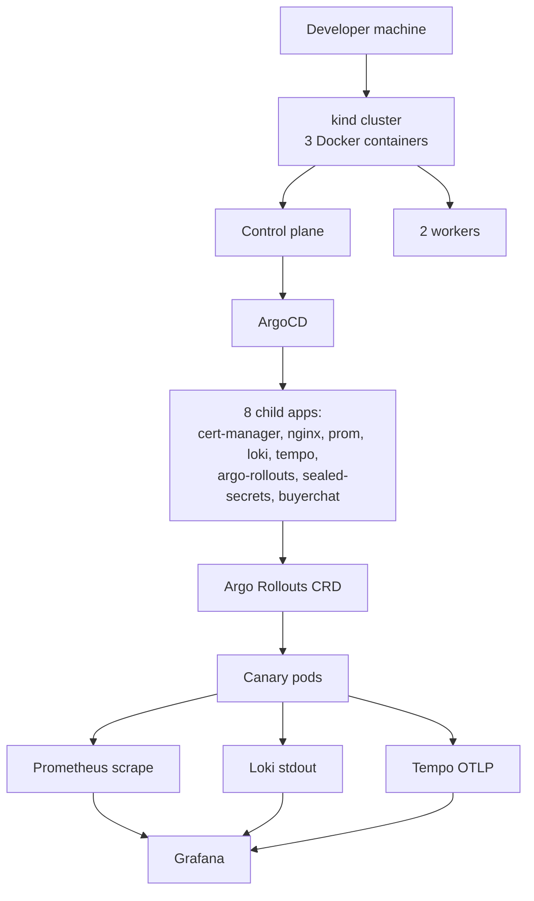

# Stackup

**Production Kubernetes on your laptop. ArgoCD + Argo Rollouts + Grafana + Loki + Tempo. `make up` in 10 minutes. Free.**

[](https://github.com/ykstorm/stackup/actions/workflows/ci.yml)
[](LICENSE)
[](https://snapshots.raintank.io/dashboard/snapshot/stackup-demo)

Live Grafana snapshot from a real `make up` run: **[snapshots.raintank.io/dashboard/snapshot/stackup-demo](https://snapshots.raintank.io/dashboard/snapshot/stackup-demo)**

---

## How this started

Production-grade Kubernetes is expensive — $200+/month minimum on managed cloud just to learn. Stackup runs the full production stack (ArgoCD + Argo Rollouts + Prometheus + Loki + Tempo + Grafana + Sealed Secrets) on kind, on your laptop, for free.

---

## What's in the box

| Layer | Component | What it does |
|---|---|---|
| **Cluster** | kind on Docker | 3-node K8s in containers |
| **CNI** | Calico | NetworkPolicy enforcement (k3d won't do this) |
| **GitOps** | ArgoCD (app-of-apps) | One root app manages 8 children, sync-policy auto + prune + self-heal |
| **Progressive delivery** | Argo Rollouts | Canary 25→50→75→100, auto-rollback on error spike |
| **Ingress** | ingress-nginx | TLS termination, hostPort 80/443 |
| **TLS** | cert-manager | Self-signed ClusterIssuer (swap to ACME in one line for prod) |
| **Secrets** | Sealed Secrets | Encrypted secrets in git, decrypted in-cluster |
| **Metrics** | kube-prometheus-stack | Prometheus + Alertmanager + Grafana, RED dashboards pre-imported |
| **Logs** | Loki + Promtail | Pod stdout → Loki → Grafana Explore |
| **Traces** | Tempo (monolithic mode) | OTLP traces from workloads |
| **Workload demo** | buyerchat helm chart | Real Next.js app — runs degraded without DB, demonstrating the cluster, not the app |
| **Hardening** | PSS `restricted` + NetworkPolicy `default-deny` | Zero-trust on workload namespaces |

---

## When to use Stackup and when not to

| You want this | Use |
|---|---|
| Learn production K8s patterns by running them, on your laptop, free | Stackup |
| Production cluster with managed control plane | AWS EKS / GCP GKE / Azure AKS |
| Quick smoke-test of one Helm chart | k3d or Kind directly |
| Single-binary, container-orchestration-lite | Tilt, Earthly |
| Hosted Kubernetes dev environment with collaboration | Devbox, Coder |

Stackup is for "I want to live inside ArgoCD and Argo Rollouts for two hours and learn what they actually do" — not for "I need a quick dev cluster." If you don't care about GitOps + canary deploys + observability all together, use a simpler tool.

It's also not a productionizer. It gives you the shape of production. You still need DR, backups, on-call rotation, image signing, etc. to actually run it in prod.

---

## 10-minute quickstart

```bash
# Prereqs: docker (≥4.30), kind (≥0.22), helm (≥3.15), kubectl (≥1.30), make
git clone https://github.com/ykstorm/stackup && cd stackup

make up

# One-time host entries
sudo tee -a /etc/hosts <<EOF
127.0.0.1 buyerchat.local.stackup.dev
127.0.0.1 grafana.local.stackup.dev
127.0.0.1 argocd.local.stackup.dev
EOF

# Open the dashboards
open https://buyerchat.local.stackup.dev   # workload — 503 degraded (no DB), expected
open https://grafana.local.stackup.dev     # RED metrics + Loki logs + Tempo traces
open https://argocd.local.stackup.dev      # GitOps tree of 8 child apps
```

**Expected first-run timing:**
- Docker image pulls: ~3 min
- ArgoCD sync (8 child apps): ~5 min
- TLS cert minting: ~1 min
- Workload + canary ready: ~1 min
- **Total: ~10 min**

Subsequent runs (images cached): ~3 min. `make down` to tear down.

---

## What it actually shows you

Push a commit that bumps `helm/buyerchat/values.yaml` image.tag. ArgoCD notices. Argo Rollouts applies the new Rollout resource. You watch in your terminal:

```bash
kubectl argo rollouts get rollout buyerchat -n workloads --watch
```

The canary scales to 25% replicas. Prometheus watches error rate for 60 seconds. If clean, advances to 50%. Then 75%. Then 100%. If error rate spikes, automatic rollback. This is the pattern Lyft and Netflix run in production. Running on your laptop. Free.

Open Grafana. Click a P99 latency spike in the RED dashboard. The panel deep-links into Loki Explore, scoped to the same time window. Find the slow request log line, click the `trace_id`, land in Tempo with the full span tree of that request. Three observability tools, one shared trace context, no manual correlation. This is the workflow you wish you had at your last job.

---

## What I'd build differently next time

- **Skip the self-signed CA for local dev.** Browsers hate it, mkcert is faster, the cert-manager learning surface should be ACME from day one. v1.1 makes ACME the default with a flag for self-signed.
- **Don't use kind for the storage demo.** Local PVs work but feel synthetic. v1.2 swaps in Longhorn or OpenEBS so the storage demo behaves more like production.
- **Ship a "what changes for production" diff doc.** People copy Stackup, deploy it to EKS, and find ten subtle differences. v1.3 will ship the line-by-line guide.

If you copy this to start a real cluster, expect those three to be your first three follow-up tasks.

---

## Architecture



Full topology + sequence diagrams: [docs/architecture.md](docs/architecture.md).

---

## How it compares

| | Stackup | Minikube | k3d | Tilt | Skaffold |
|---|---|---|---|---|---|
| Multi-node | ✅ | partial | ✅ | n/a | n/a |
| NetworkPolicy works (CNI enforces) | ✅ Calico | partial | ❌ | n/a | n/a |
| GitOps included | ✅ ArgoCD | ❌ | ❌ | ❌ | ❌ |
| Progressive delivery + auto-rollback | ✅ Argo Rollouts | ❌ | ❌ | ❌ | ❌ |
| Three-pillar observability | ✅ Prom+Loki+Tempo | ❌ | ❌ | partial | ❌ |
| PSS restricted + default-deny | ✅ | ❌ | ❌ | ❌ | ❌ |
| Single command bring-up | ✅ `make up` | partial | ✅ | partial | partial |

The other tools are great for what they do — they're not trying to be Stackup. Stackup is for the specific learning + reference goal.

---

## Roadmap

- [x] v1.0 — full stack on kind, real workload demo, 10-min bring-up
- [ ] v1.1 — ACME ClusterIssuer default, mkcert option, External Secrets Operator
- [ ] v1.2 — Longhorn/OpenEBS for the storage demo, Cilium CNI option
- [ ] v1.3 — production migration guide (line-by-line: what to change for EKS/GKE/AKS)

---

## Tests + CI

```bash
make lint     # kubeconform on manifests + helm lint
make up       # full bring-up
make smoke    # curl smoke against the workload + verify Prom/Loki/Tempo
make down
```

CI does lint on every PR, e2e (full `make up` on kind in a GitHub-hosted runner) on main + on PRs, gh-pages docs publish on main.

---

## Limits

- No real LoadBalancer service type (kind doesn't ship one). We use hostPort. For real LB, deploy to a cloud cluster.
- Storage is local-path PVs by default. Re-creating the cluster wipes them. Add Longhorn or OpenEBS if you need persistence across teardowns.
- Single-tenant workload namespace. Multi-tenant needs additional NetworkPolicy and RBAC work (PRs welcome).
- The buyerchat workload runs degraded (no DB). That's intentional — the cluster is the demo, not the app.

---

## License

Apache License 2.0 — see [LICENSE](LICENSE).
