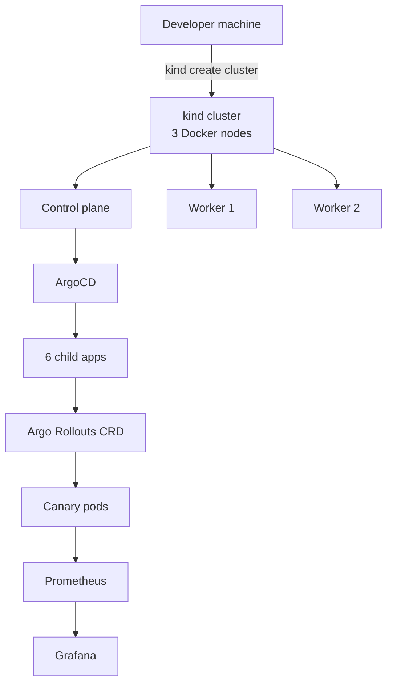

# Stackup

**Kubernetes on your laptop. ArgoCD + Argo Rollouts + Prometheus + Grafana. `make up` in ~12–15 minutes. Free.**

[](https://github.com/ykstorm/stackup/actions/workflows/ci.yml)
[](LICENSE)

---

## Why Stackup

Managed Kubernetes costs $200+/month minimum on cloud providers. Stackup runs the full production stack on kind, on your laptop, for free.

What "full production stack" means: a real ArgoCD app-of-apps with 6 child applications, Argo Rollouts canary progressive delivery, Prometheus + Grafana observability, cert-manager TLS, Sealed Secrets encrypted in git, Calico NetworkPolicy enforcement, and Pod Security Standards `restricted` on every workload namespace.

The buyerchat workload deliberately runs degraded (no DB). That's intentional. The cluster is the demo — not the app.

---

## What's in the box

| Layer | Component | What it does |
|---|---|---|
| **Cluster** | kind on Docker | single-node K8s in containers |
| **CNI** | Calico | NetworkPolicy enforcement |
| **GitOps** | ArgoCD (app-of-apps) | One root app manages 6 children; automated sync + prune + self-heal |
| **Progressive delivery** | Argo Rollouts | Canary 25→50→75→100%, analysis gate at 25% with auto-rollback |
| **Ingress** | ingress-nginx | TLS termination, hostPort 80/443 |
| **TLS** | cert-manager | Self-signed ClusterIssuer (swap to ACME in one line for prod) |
| **Secrets** | Sealed Secrets | Encrypted secrets in git, decrypted in-cluster |
| **Metrics** | kube-prometheus-stack | Prometheus + Alertmanager + Grafana |
| **Workload demo** | buyerchat Helm chart | Next.js app — demonstrates the cluster, not a production app |
| **Hardening** | PSS `restricted` + NetworkPolicy `default-deny` | Zero-trust on workload namespaces |

### Roadmap (not installed yet)

| Layer | Component | What it would do |
|---|---|---|
| **Logs** | Loki + Promtail | Pod stdout → Loki → Grafana Explore |
| **Traces** | Tempo | OTLP traces from workloads |

---

## Quickstart

```bash
git clone https://github.com/ykstorm/stackup && cd stackup
make up
```

Add to `/etc/hosts` (Windows: `C:\Windows\System32\drivers\etc\hosts`):

```
127.0.0.1 buyerchat.local.stackup.dev
127.0.0.1 grafana.local.stackup.dev
127.0.0.1 argocd.local.stackup.dev
127.0.0.1 prometheus.local.stackup.dev
```

Then open:

- **[https://buyerchat.local.stackup.dev](https://buyerchat.local.stackup.dev)** — workload, returns 503 degraded (no DB — expected)
- **[https://grafana.local.stackup.dev](https://grafana.local.stackup.dev)** — RED metrics from Prometheus (logs/traces are roadmap)
- **[https://argocd.local.stackup.dev](https://argocd.local.stackup.dev)** — GitOps tree of 6 child apps

---

## What it actually shows you

Push a commit that bumps `helm/buyerchat/values.yaml` image.tag. ArgoCD notices and syncs. Argo Rollouts applies the new Rollout revision. Watch it advance:

```bash
make rollout-status
# same as: kubectl argo rollouts get rollout buyerchat -n app --watch
```

The canary shifts 25% of traffic to the new version, pauses, then runs an analysis step: an `AnalysisTemplate` queries Prometheus three times over 90 seconds. If the success condition holds, the rollout advances to 50%, then 75%, then 100%. If the analysis fails, Argo Rollouts aborts and rolls back to the previous revision. This is the canary pattern teams run in production, on your laptop, for free.

The current analysis query is a conservative liveness check (is the canary up and being scraped). Once the buyerchat image exports request counters on `/api/metrics`, swap it for a real success-rate ratio — the template carries a `TODO` marking the one line to change.

---

## Architecture



For full topology + sequence diagrams, see [docs/architecture.md](docs/architecture.md).

A static documentation site (overview, getting started, architecture, GitOps + canary) is built from `docs-site/` and published to GitHub Pages on merge to `main`.

---

## Makefile targets

```bash
make help     # Show all targets
make up             # Full bring-up: create cluster + install platform + buyerchat
make down           # Tear down kind cluster (clean)
make smoke          # Run smoke tests (requires cluster up)
make lint           # Lint all YAML + Helm charts
make rollout-status # Watch the buyerchat Argo Rollout canary progress
```

---

## Limits

- No real LoadBalancer service type (kind doesn't ship one). We use hostPort. For real LB, deploy to a cloud cluster.
- Storage is local-path PVs by default. Re-creating the cluster wipes them. Add Longhorn or OpenEBS if you need persistence across teardowns.
- Single-tenant workload namespace. Multi-tenant needs additional NetworkPolicy and RBAC work (PRs welcome).
- The buyerchat workload runs degraded (no DB). That's intentional — the cluster is the demo, not the app.

## License

Apache License 2.0 — see [LICENSE](LICENSE).