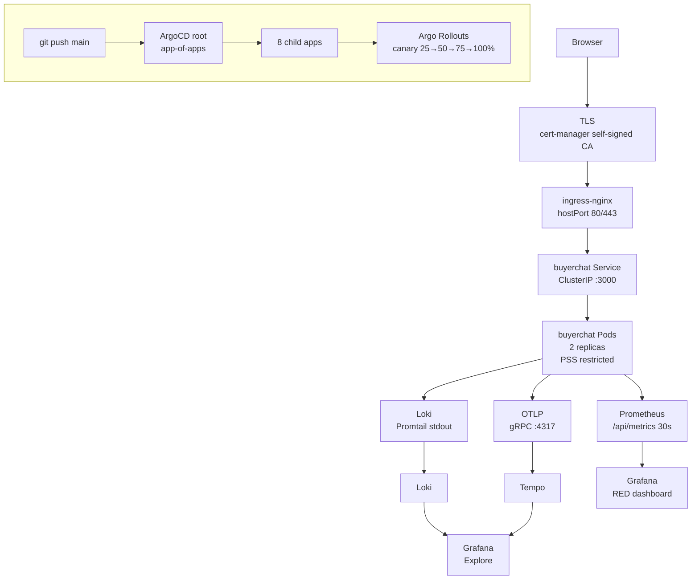

# devops-showcase

[](https://github.com/ykstorm/devops-showcase/actions/workflows/ci.yml)
[![License: Apache 2.0

**GitOps-native Kubernetes platform on your local machine.**
kind cluster + ArgoCD app-of-apps + Argo Rollouts (canary deploys + auto-rollback) + Prometheus + Loki + Tempo + Grafana. `make up` brings up the full stack in under 10 minutes. Zero infra cost.

Built as the platform-engineering counterpart to Homesty.ai's buyerchat — demonstrates the infrastructure that production software actually runs on.

---

## Why I built this

I wanted to understand Kubernetes the way you understand code — by building something real. Not a toy cluster that runs one service. A full observability stack: ArgoCD for GitOps, canary deploys for progressive delivery, Prometheus + Loki + Tempo for metrics/logs/traces.

The constraint was money — I couldn't afford cloud Kubernetes. kind runs on Docker, no VM needed, and the entire cluster costs nothing to run locally. The tradeoff is that it can't do everything a cloud cluster can (no LoadBalancer service type, limited storage), but for a showcase it's sufficient.

---

## Quick start

```bash
# Prerequisites: docker, kind, helm >=3.15, kubectl, git
git clone https://github.com/ykstorm/devops-showcase && cd devops-showcase

# Full bring-up (~10 min on first run)
make up

# After bring-up — verify
curl https://buyerchat.local.devops-showcase.dev/api/healthcheck
# → HTTP 503 {"status":"degraded","reason":"db_unreachable"}
#   (expected — no real DB connected, buyerchat runs in degraded mode as the workload demo)

# Full teardown
make down
```

### Host entries required

Add to `/etc/hosts`:
```
127.0.0.1 buyerchat.local.devops-showcase.dev
127.0.0.1 grafana.local.devops-showcase.dev
127.0.0.1 argocd.local.devops-showcase.dev
127.0.0.1 prometheus.local.devops-showcase.dev
```

---

## What it includes

| Layer | Component | What it does |
|---|---|---|
| **GitOps** | ArgoCD (app-of-apps) | 1 root app manages 8 child apps — sync-policy automated + prune + self-heal |
| **Progressive delivery** | Argo Rollouts | Canary: 25% → 50% → 75% → 100%, auto-rollback on error spike |
| **Ingress** | ingress-nginx | TLS termination, hostPort 80/443, proxy to buyerchat:3000 |
| **TLS** | cert-manager | Self-signed CA ClusterIssuer (swap to ACME for production — one line change) |
| **Secrets** | Sealed Secrets | Encrypted secrets committed to git, controller decrypts in-cluster |
| **Metrics** | Prometheus + Grafana | /api/metrics scrape, 30s interval, RED dashboard auto-import |
| **Logs** | Loki + Promtail | Pod stdout → Loki → Grafana Explore |
| **Traces** | Tempo (monolithic) | OTLP traces from buyerchat |
| **Security** | NetworkPolicy default-deny + PSS restricted | Zero trust on workload namespaces |

---

## Architecture



**GitOps flow**: git push → ArgoCD root app detects change → syncs 8 child apps in waves (foundation → observability → workload) → Argo Rollouts begins canary → metrics flow to Grafana.

---

## The tricky part — ArgoCD app-of-apps sync waves

Getting 8 child apps to sync in the right order was harder than expected. ArgoCD doesn't guarantee ordering by default — child apps can try to install before their dependencies are ready (cert-manager needs to exist before the TLS cert can be issued).

I used sync waves: foundation components (ingress-nginx, cert-manager, sealed-secrets, argo-rollouts) are applied in wave 0, observability (prometheus, loki, tempo) in wave 1, and the workload (buyerchat) in wave 2. ArgoCD's `sync-wave` annotation on the Application resources controls this.

The second tricky part was getting Grafana to import the RED dashboard without manually configuring a Prometheus datasource. The trick: add `grafana_dashboard: "1"` label to the buyerchat ConfigMap that holds the dashboard JSON. Grafana's kube-prometheus-stack scans for ConfigMaps with that label in any namespace and auto-imports them.

---

## Key decisions documented

- **Self-signed CA vs ACME**: Local cluster can't reach Let's Encrypt. Self-signed ClusterIssuer works identically in the browser. Swap to ACME is one line in `values.yaml`.
- **Sealed Secrets vs Vault/ESO**: Sufficient for a showcase. Controller key is per-cluster — if the cluster is deleted, sealed secrets are unrecoverable. Documented limitation.
- **kind vs k3d vs minikube vs cloud**: kind is Docker-native, most portable, zero cost. k3d needs a container runtime inside Docker. minikube needs a VM driver. Cloud costs money.
- **Tempo monolithic vs distributed**: Single binary. Distributed mode adds ~3 more microservices. Sufficient for a showcase.

Full tradeoffs in [`docs/tradeoffs.md`](./docs/tradeoffs.md).

---

## CI quality gates

Every PR and push runs:
```bash
helm lint helm/buyerchat
helm template | kubeconform --strict --summary --ignore-missing-schemas
yamllint --quiet .
# + deprecated API check in Helm output
```

No deploy step from CI. ArgoCD is the only mutator of cluster state — CI just validates that manifests are correct.

---

## What this project proves

For a fresher/junior platform/DevOps role, this shows I can:

- Set up a Kubernetes cluster from scratch (kind, not managed cloud K8s)
- Configure GitOps with ArgoCD (app-of-apps pattern, sync waves)
- Implement progressive delivery (Argo Rollouts canary deploys + auto-rollback)
- Wire observability: metrics (Prometheus), logs (Loki), traces (Tempo), dashboards (Grafana)
- Handle TLS with cert-manager (self-signed CA, ClusterIssuer pattern)
- Write Helm charts (buyerchat chart with Deployment, Service, Ingress, NetworkPolicy)
- Configure Pod Security Standards restricted, NetworkPolicy default-deny

---

## License

MIT — see [LICENSE](LICENSE).