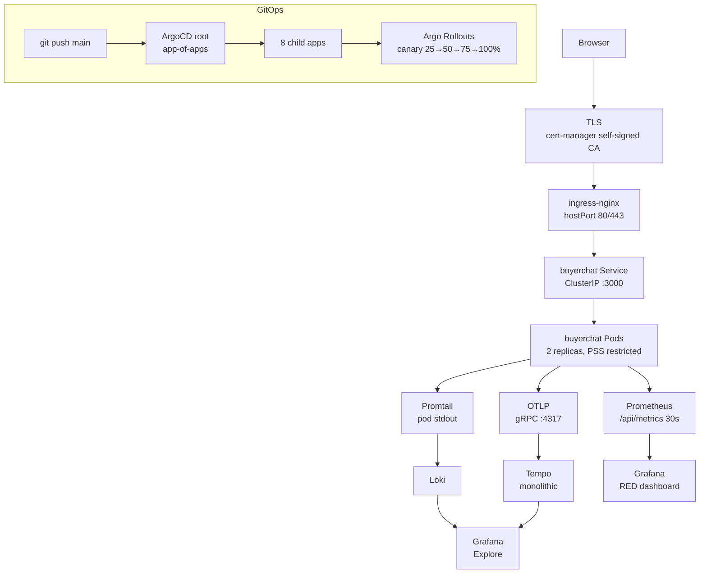

# SPEC.md — devops-showcase

> 1-page summary. Verify every claim against actual code/config before committing.

---

## What it is

**devops-showcase** is a GitOps-native Kubernetes platform running on a local kind cluster. It demonstrates production-grade infra: ArgoCD app-of-apps, Argo Rollouts canary deploys, ingress-nginx, cert-manager TLS, Sealed Secrets, Prometheus + Loki + Tempo + Grafana observability stack. `make up` brings up everything in under 10 minutes. $0 infra cost.

---

## Core features (verified in config/code)

| Feature | Location |
|---|---|
| kind cluster (single-node, Calico CNI, ports 80/443) | `kind/cluster.yaml` |
| ArgoCD app-of-apps (1 root + 8 child apps) | `infra/argocd/` |
| Argo Rollouts canary deploys (25→50→75→100%, auto-rollback) | `helm/buyerchat/` |
| ingress-nginx hostPort 80/443 | `infra/ingress-nginx/` |
| cert-manager self-signed ClusterIssuer | `infra/cert-manager/` |
| Sealed Secrets (encrypted in git, controller decrypts) | `infra/sealed-secrets/` |
| kube-prometheus-stack (Prometheus + Grafana + exporters) | `infra/kube-prometheus-stack/` |
| Loki + Promtail (logs) | `infra/loki/` |
| Tempo monolithic (traces) | `infra/tempo/` |
| NetworkPolicy default-deny + PSS restricted | `helm/buyerchat/templates/network-policy.yaml` |
| `make up` / `make down` / `make smoke` | `Makefile` |
| CI: helm lint, kubeconform, yamllint | `.github/workflows/ci.yml` |

---

## Architecture

---

## Key design decisions

1. **Self-signed CA over ACME** — Local kind cluster can't reach Let's Encrypt's ACME servers. Self-signed ClusterIssuer works identically in the browser. Swap to ACME is one line in `values.yaml`.

2. **Sealed Secrets over Vault/ESO** — Sufficient for a showcase. Controller key is per-cluster and ephemeral — if the cluster is deleted, the sealed secrets are unrecoverable. Documented limitation.

3. **kind over k3d/minikube/cloud** — kind is Docker-native, most portable, zero cost. k3d needs a container runtime inside Docker (overhead). minikube needs a VM driver. Cloud is out of scope.

4. **Tempo monolithic over distributed** — Single binary. Distributed mode adds 3 more microservices and YAML complexity. For a showcase, monolithic is sufficient.

5. **ArgoCD app-of-apps pattern** — One root Application manages 8 child Applications. Sync waves ensure foundation (ingress, cert-manager) installs before observability, and observability before the workload. Automated sync + self-heal + prune.

---

## CI quality gates

The CI workflow runs:
1. `helm lint` — buyerchat chart
2. `helm template | kubeconform --strict` — schema validation
3. `yamllint` — all YAML files
4. Deprecated API check in Helm output

No deploy step from CI. ArgoCD is the only mutator of cluster state.

---

## Gaps identified

- No INTERVIEW_REPORT.md yet (written in this polish)
- README has ASCII architecture diagram (not Mermaid) — will upgrade
- README says "Apache 2.0" in footer but LICENSE file says "MIT" — will fix
- No pre-commit hooks

---

## GitHub topics

Add: `kubernetes`, `argocd`, `helm`, `devops`, `gitops`, `grafana`, `prometheus`, `loki`, `tempo`, `kind`, `terraform-equivalent` (or just `infrastructure`)