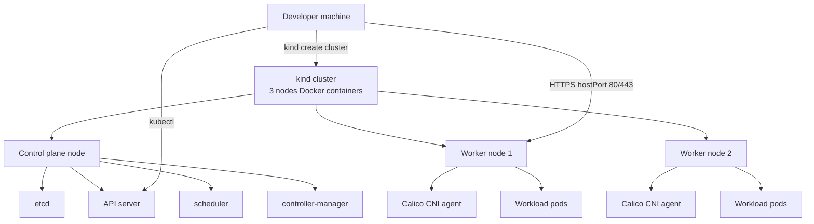
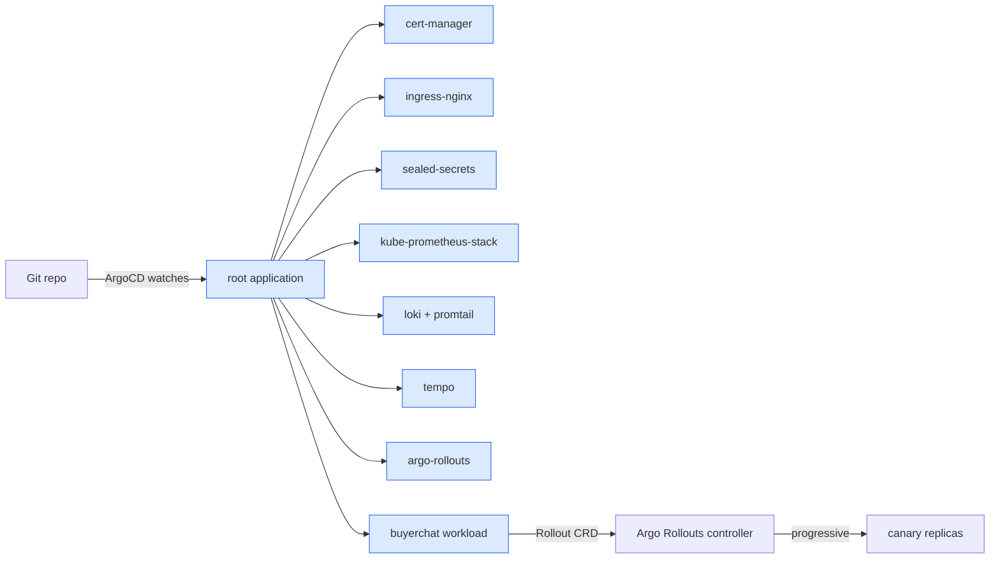
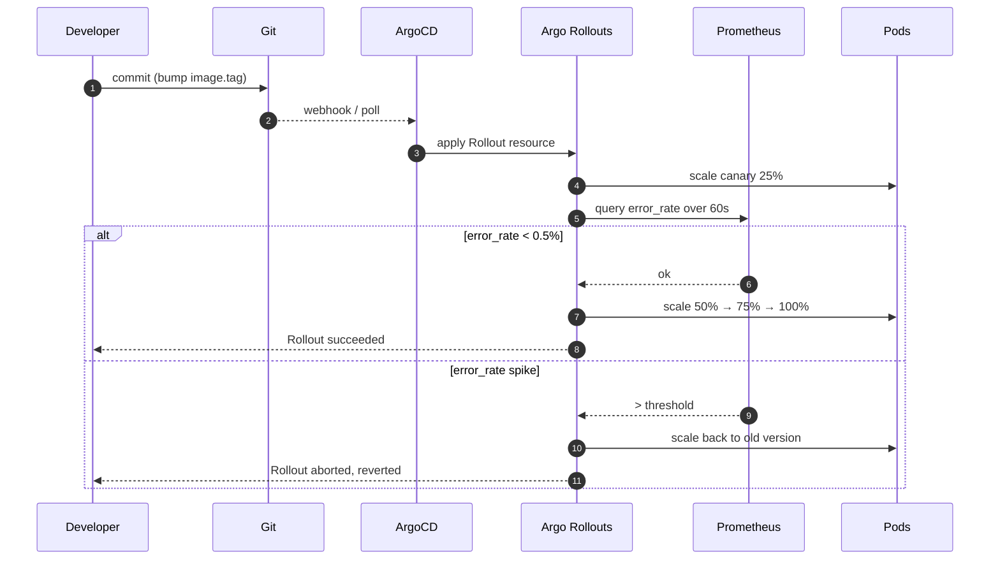
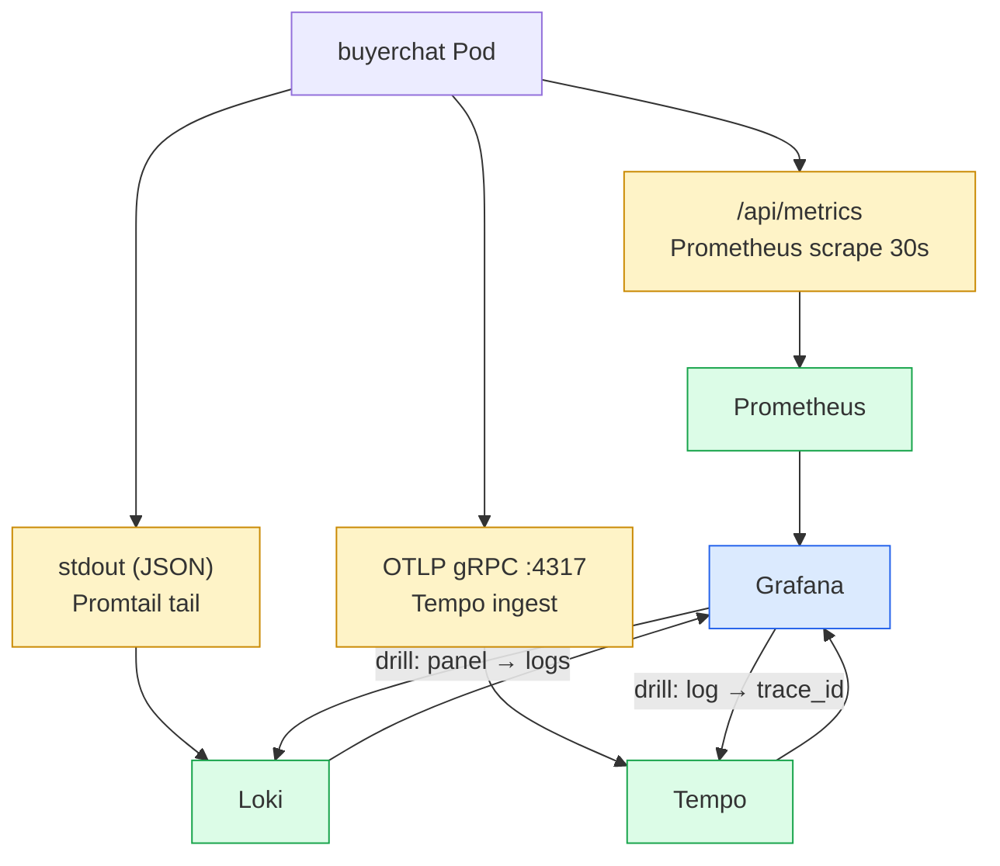

# Stackup — Architecture

## 1. Cluster topology

kind launches 3 Docker containers — one control-plane + two workers. Each node is itself a Docker container running containerd + kubelet. Pods run inside the workers as containers-within-containers. The whole thing fits in ~3 GB of RAM.

## 2. GitOps tree (app-of-apps)

The root Application is the only thing applied by `make up`. Everything else is sync'd by ArgoCD from the git repo. That's the discipline: state lives in git, not in `kubectl apply` commands.

## 3. Progressive delivery flow

## 4. Observability triangle

The triangle is the standard you'll find in any production-grade shop. Stackup ships it pre-wired.

## 5. Security posture

| Layer | Control |
|---|---|
| Pod admission | PSS (Pod Security Standards) `restricted` profile on workload namespaces |
| Network | NetworkPolicy `default-deny` on workload namespaces, explicit allow rules per service |
| Secrets | Sealed Secrets — secrets encrypted in git, decrypted only in-cluster |
| TLS | cert-manager self-signed CA (swap to ACME for production) |
| RBAC | Workload namespaces have no cluster-admin bindings |
| Image policy | (out of scope v1.0) — recommended: Cosign + admission webhook |

## 6. What's intentionally simplified

- **Single-cluster.** No multi-cluster, no Fleet, no cross-cluster GitOps. Add when you need it.
- **Single-tenant.** Workload namespace is a single tenant. Multi-tenant adds Network/RBAC policy noise.
- **No LoadBalancer.** kind doesn't have one. We use `hostPort` for ingress.
- **No persistent storage for the demo.** buyerchat's helm chart points to a non-existent DB on purpose — it runs degraded. The point isn't to be a working app; it's to be a working *cluster*.

## 7. What changes for production

When you take this to AWS EKS / GCP GKE / Azure AKS, change:
1. kind → managed K8s control plane (EKS / GKE / AKS)
2. self-signed ClusterIssuer → ACME (Let's Encrypt) via DNS-01
3. `hostPort` ingress → real LoadBalancer service type
4. Local volumes → CSI driver for cloud block storage
5. Single replica components → HA (Prometheus with Thanos, Loki with Boltdb-shipper)
6. RBAC bindings tightened (no full cluster-admin tokens)

See [docs/production-guide.md] (v1.3 roadmap) for the line-by-line diff.
